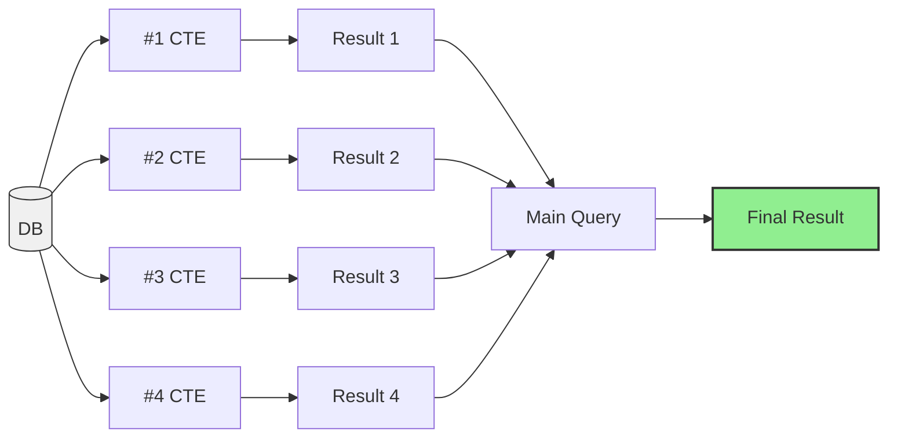
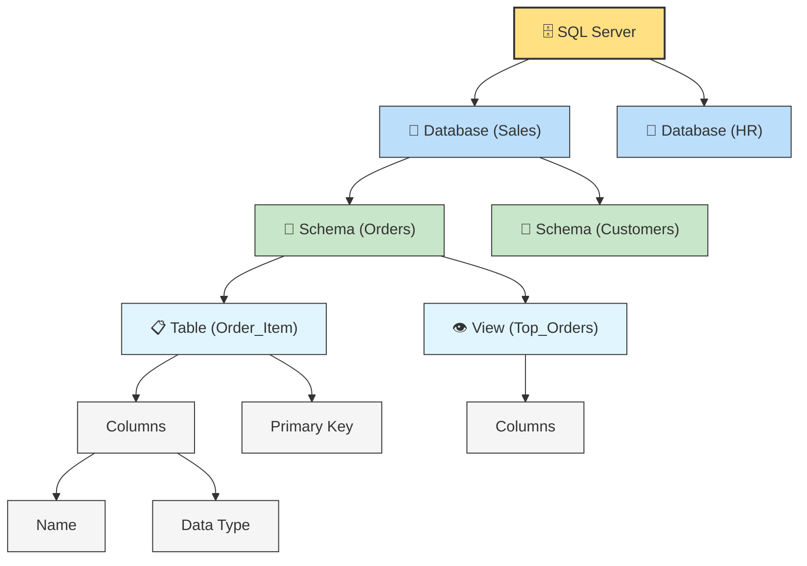

### Index
[0. MSSQL code](./images/SQL/salesdb.sql)

[1. Advanced SQL Techniques (Subqueries, CTE, View, Temp Tables, Store proc, Trigger)]()

[2. Performance Optimization (Index, Partitions, Performance Tips)]()

# Advanced SQL Techniques
## Database Architecture


We have client side where we write sql query and in server side there are server components like the database engine, storage we have two components in it disk and cache.

**Database Engine** is the brain of the database, executing multiple operations such as storing, retrieving, and managing data within the database.

In storage we have **user**, **catalog** and **temp**. 

**User** is the main component of the database this is where the actual data that users care about is stored. e.x. all the tables is the users data. 

**Catalog** is the database's internal storage for its own information a blueprint that keeps track of everything about the database itself not the user data. **Information Schema** a system-defined schema with built-in views that provide info about the database, like tables and columns.
```sql
SELECT * FROM INFORMATION_SCHEMA.COLUMNS
```
**Temp** is the temporary storage used by the database for short-term tasks, like processing queries or sorting data. Once these tasks are done, the storage is cleared. e.x- inside system databases --> tempdb --> tables --> temporary tables.

**HOW  QUERY WORKS :-**
We write a simple select query it send to the server the database engine takes inorder to process it. so, first it check weather we have the data in the cache if yes it will return if no then database engine checks in the disk and it find the details and the query can be executed. Then the result of the query can be send back to the client side.

 
## 1. Subqueries

**Subquery:** A query nested inside another (main) query.


### How it works :-

When the whole query is executed, the subquery runs first. Its result is **not** sent directly to the user — instead, it stays inside the query as an **intermediate result**.

The main query then works with two sources of data:

1.  The **intermediate result** returned by the subquery
2.  The **original database tables**

The main query's job is to combine data from both sources and return the final output to the user.

### Why We Need Subqueries

In complex tasks, we might need to perform several operations together, such as:
1. Joining tables
2. Filtering
3. Transformation
4. Aggregation

Instead of writing a separate standalone query for each step, we can nest them as subqueries within one query:
1. **Joining tables** → subquery
2. **Filtering** → subquery
3. **Transformation** → subquery
4. **Aggregation** → main query

This way, each step feeds its intermediate result into the next, all within a single combined query.


### Types:
Based on Dependency :-
1. Non-correlated subquery : Subquery is independent of the main query.
2. Correlated subquery : Subquery is dependent of the main query.

Based on Result Types :-
1. **Scalar subquery** it return single value.
```sql
SELECT AVG(Sales) FROM Sales.Orders
```
2. **Row subquery**  it return multiple rows and single column.
```sql
SELECT CustomerID FROM Sales.Orders
```
3. **Table subquery** it returns multiple rows & multiple column.
```sql
SELECT * FROM Sales.Orders
```

**Location/Clauses** : where the subquery can be used within the main query :-
1. SELECT : used to aggregate data side by side with the main query's data, allowing for direct comparison.
```sql
-- Show the product IDs, product names, prices, and total number of orders.
-- Main Query
SELECT 
	ProductID, 
	Product, 
	Price,
	-- Sub Query
	(SELECT COUNT(*) FROM Sales.Orders) AS TotalOrders
FROM Sales.Products
```

2. FROM
```sql
-- 1. Find the products that have a price higher then the average price of all products.

-- Main Query
SELECT * FROM
	-- Sub Query
	(SELECT ProductID, Price, AVG(Price) OVER() AvgPrice
	FROM Sales.Products)t
WHERE price > AvgPrice

-- 2. Rank Customers based on their total amount of sales.
-- Main Query
SELECT *, RANK() OVER (ORDER BY TotalSales DESC) CustomerRank
FROM
	-- Sub Query
	(SELECT 
	CustomerID,
	SUM(Sales) TotalSales
	FROM Sales.Orders
	GROUP BY CustomerID)t
```
3. JOIN : Used to prepare the data(filtering or aggregation) before joining it with other tables.
```sql
-- Show all customer details and find the total orders of each customer.
-- Main Query
SELECT c.*, o.TotalOrders
FROM Sales.Customers c
LEFT JOIN  (
	SELECT
	CustomerID,
	COUNT(*) TotalOrders
	FROM Sales.Orders
	GROUP BY CustomerID) o
ON c.CustomerID = o.CustomerID
```

4. WHERE : used for complex filtering logic and makes query more flexible and dynamic.
```sql
-- Find the producets that have a price higher than the average price of all products.
SELECT 
ProductID,
Price
FROM Sales.Products
WHERE Price > (SELECT AVG(Price) FROM Sales.Products)

-- AvgPrice
SELECT 
ProductID,
Price,
(SELECT AVG(Price) FROM Sales.Products) AvgPrice
FROM Sales.Products
WHERE Price > (SELECT AVG(Price) FROM Sales.Products)
```

## 2. CTE
Comman Table Expression is temporary, named result set (virtual table), that can be used times within your query to simplify and organize complex query.
### WHY CTE ?


Here in the above image we are repeating the same subquery of JOIN twice which cause redundancy. So, we reuse the Step1 again and we can do this with the help of CTE.

In subquery the steps are bottom to top but in CTE steps will be Top to Bottom.

### How DB Execute CTE


As a Data Analyst, we write a query that has two parts: a **CTE Query** (`WITH Details AS (SELECT...)`) and a **Main Query** that selects data from `Orders` and joins it with `Details` multiple times.

Once we execute the query, it travels from the Client to the **Database Engine**, which passes it to the Server for processing.

#### Step 1: CTE Executes First
The Database Engine reads the query and recognizes that the CTE has priority, so it executes the CTE first. It fetches the required data from **Disk** (from the catalog/user tables) and stores the result in the **Cache**, naming this cached result **"Details"** — similar to a temporary table.

#### Step 2: Main Query Executes
Next, the Database Engine executes the **Main Query** step by step. Since the Main Query references `Details` multiple times (via multiple `JOIN`s), it pulls this data directly from the **Cache** instead of recalculating it or going back to disk each time.

#### Why This Matters
This is one of the biggest benefits of using a CTE — the repeated `JOIN`s reuse the same cached result from high-speed memory instead of being recomputed from disk every time, making retrieval much faster.

#### Final Step: Returning the Result
Once the Main Query finishes executing, the final result is sent back from the Server, through the **Database Engine**, to the **Client**, where the Data Analyst sees it as the **Result**.

### CTE TYPES:-
1. **None-Recursive CTE**
	
	a. **Standalone CTE**: runs independently as it's self-contained and doesn't rely on other CTEs or queries.
	
> DB --> CTE --> Intermediate --> Main Query --> Final Result

Independent :  DB --> CTE 

Dependent : Intermediate --> Main Query -->  : Because the main query cannot be executed alone because it need the result from the first query.
```sql
-- Find the total Sales Per Customer (Standalone CTE)
WITH CTE_Total_Sales AS
(
SELECT
	CustomerID,
	SUM(Sales) AS TotalSales
FROM Sales.Orders
GROUP BY CustomerID -- intermediate result this will execute and store in db memory
)
-- Main Query last order date for each customer
SELECT
c.CustomerID,
c.FirstName,
c.LastName,
cts.TotalSales  -- comes from CTE
FROM Sales.Customers c
LEFT JOIN CTE_Total_Sales cts
ON cts.CustomerID = c.CustomerID
```
#### Multiple CTE

```sql
-- Find the total Sales Per Customer (Standalone CTE)
WITH CTE_Total_Sales AS
(
SELECT
	CustomerID,
	SUM(Sales) AS TotalSales
FROM Sales.Orders
GROUP BY CustomerID -- intermediate result this will execute and store in db memory
)
-- last order date for each customer
, CTE_Last_Order AS
(
SELECT 
	CustomerID,
	MAX(OrderDate) AS Last_Order
FROM Sales.Orders
GROUP BY CustomerID
)
-- Main Query 
SELECT
c.CustomerID,
c.FirstName,
c.LastName,
cts.TotalSales  -- comes from CTE
FROM Sales.Customers c
LEFT JOIN CTE_Total_Sales cts
ON cts.CustomerID = c.CustomerID
```
b. **Nested CTE** :  It uses the result of another CTE, so it can't run independently.
```sql
-- 1. Find the total Sales Per Customer (Standalone CTE)
WITH CTE_Total_Sales AS
(
SELECT
	CustomerID,
	SUM(Sales) AS TotalSales
FROM Sales.Orders
GROUP BY CustomerID 
)
-- 2. Last order date for each customer
, CTE_Last_Order AS
(
SELECT 
	CustomerID,
	MAX(OrderDate) AS Last_Order
FROM Sales.Orders
GROUP BY CustomerID
)
-- 3. Rank CUstomer based on Total Sales Per Customer (Nested CTE)
, CTE_Customer_Rank AS
(
SELECT 
CustomerID,
TotalSales,
RANK() OVER (ORDER BY TotalSales DESC) AS CustomerRank
FROM CTE_Total_Sales -- Reusing the CTE 1
) 
-- SELECT * FROM CTE_Customer_Rank

-- 4. Segment Customer based on their Total Sales (Nested CTE)
, CTE_Customer_Segments AS
(
SELECT 
CustomerID,
TotalSales,
CASE WHEN TotalSales > 100 THEN 'HIGH'
	WHEN TotalSales > 50 THEN 'Medium'
	ELSE 'LOW'
END CustomerSegments
FROM CTE_Total_Sales
)
-- SELECT * FROM CTE_Customer_Segments

-- Main Query 
SELECT
c.CustomerID,
c.FirstName,
c.LastName,
cts.TotalSales, 
clo.Last_Order,
ccr.CustomerRank,
ssg.CustomerSegments
FROM Sales.Customers c

LEFT JOIN CTE_Total_Sales cts
ON cts.CustomerID = c.CustomerID

LEFT JOIN CTE_Last_Order clo
ON clo.CustomerID = c.CustomerID

LEFT JOIN CTE_Customer_Rank ccr
ON ccr.CustomerID = c.CustomerID

LEFT JOIN CTE_Customer_Segments ssg
ON ssg.CustomerID = c.CustomerID
```
2. **Recursive CTE** : self-referencing query that repeatedly processes data until a specific condition is met.
```sql
-- Generate a squence of number from 1 - 10.
WITH Series AS (
	-- Anchor Query
	SELECT
	1 AS MyNumber
	UNION ALL
	-- Recursive Query
	SELECT
	MyNumber + 1
	FROM Series
	WHERE MyNumber < 10
)
-- Main Query
SELECT * FROM Series
```

```sql
-- Show the employee hierarchy by displaying each emloyee's level within organization.
WITH CTE_Emp_Hierarchy AS
(
	SELECT 
		EmployeeID,
		FirstName,
		ManagerID,
		1 AS Level
	FROM Sales.Employees
	WHERE ManagerID IS NULL

	UNION ALL

	SELECT 
		e.EmployeeID,
		e.FirstName,
		e.ManagerID,
		Level + 1
	FROM Sales.Employees AS e
	INNER JOIN CTE_Emp_Hierarchy ceh
	ON e.ManagerID = ceh.EmployeeID
)

SELECT * FROM CTE_Emp_Hierarchy
```


## 3. VIEW
It is a virtual table that shows data without storing it physically. In order to see the data, we have to execute the query behind the view.

### Database Structure


### How we get the output from Table?
The sql query trigger the queue that is attached to the view and the query is responsible to query the physical table and then the result is going to fill the structure of the view and we get back the result.

We are directly querying the view but actually we indirectly querying a physical table.


### Difference
| VIEW | TABLE |
|--|--|
| No Persistance | Persisted Data |
| Easy to Maintain | Hard to maintain |
| Slow Response | Fast Response |
| Read | Read/Write |
### Why to use Views?


In 1st all the Analyst using the same CTE query to get the result. so it is complete redundecy and make no sense.

so, 2nd we can do the first step as view in database insist of using CTE `SUM JOIN` each time we're going to take this script and put it in the database. So, the analyst, instead of going directly to the physical tables they can goto the view.

### Difference View & CTE

| VIEWS | CTE |
|--|--|
| Reduce redundancy in multi-queries | Reduce Redundancy in single query |
| Improve reusability in multi-queries | Improve reusability in single query |
| Persisted Logic | Temporary logic |
| Need to maintain - Create/Drop| no maintenance - auto cleanup |

```sql
-- (https://github.com/DataWithBaraa/sql-ultimate-course/blob/main/datasets/sql-server/init-sqlserver-salesdb.sql)
-- To Find the running Total of Sales for each month.
-- Without View using CTE
WITH CTE_Monthly_Summary AS (
	SELECT 
	DATETRUNC(month, OrderDate) OrderMonth,
	SUM(Sales) TotalSales,
	COUNT(OrderID) TotalOrders,
	SUM(Quantity) TotalQuantities
	FROM Sales.Orders
	GROUP BY DATETRUNC(month, OrderDate)
)
SELECT OrderMonth, TotalSales, SUM(TotalSales) OVER (ORDER BY OrderMonth) AS RunningTotal
FROM CTE_Monthly_Summary;

-- Using View : if a table or view is created without specifying a schema, it defaults to the DBO.
CREATE VIEW V_Monthly_Summary AS
(
	SELECT 
	DATETRUNC(month, OrderDate) OrderMonth,
	SUM(Sales) TotalSales,
	COUNT(OrderId) TotalOrders,
	SUM(Quantity) TotalQuantities
	FROM Sales.Orders
	GROUP BY DATETRUNC(month, OrderDate)
)

-- Insist of Query the above we will query the below view.
SELECT * from V_Monthly_Summary;

SELECT OrderMonth, TotalSales, SUM(TotalSales) OVER (ORDER BY OrderMonth) AS RunningTotal
FROM V_Monthly_Summary;

-- Creating View as Sales Schema
CREATE VIEW Sales.V_Monthly_Summary AS
(
-- ...
)

-- DROP VIEW
DROP VIEW Sales.V_Monthly_Summary;

-- TO modify the existing View in SQL Server we must drop it and recreate is with the change we need.
-- In Postgres we just add `CREATE OR REPLACE VIEW ..`
-- OR using T-SQL we can replace it. see below example.
IF OBJECT_ID('V_Monthly_Summary', 'V') IS NOT NULL
	DROP VIEW V_Monthly_Summary;
GO
CREATE VIEW V_Monthly_Summary AS
(
	SELECT 
	DATETRUNC(month, OrderDate) OrderMonth,
	SUM(Sales) TotalSales,
	COUNT(OrderId) TotalOrders
	FROM Sales.Orders
	GROUP BY DATETRUNC(month, OrderDate)
)
```

### How the Database Executes Views

#### Step 1: Creating a View

When a data engineer creates a view (e.g., `TopN`), the query is sent to the **Database Engine**. The engine recognizes this is a **view**, not a table, and handles it differently.

The engine goes to the **Disk Storage → Catalog**, and stores:

1.  **Metadata** about the view
2.  The **actual SQL query** defined in the `CREATE VIEW` statement

> **Key difference from tables:** For a regular table, the catalog stores only **metadata**. For a view, the catalog stores **both the metadata and the underlying query**.

Importantly, the database engine does **not** create a physical table or store any actual data — no data is written to disk or cache. Only the **metadata and the query definition** are stored in the system catalog.

----------

#### Step 2: Querying a View

Once the view exists, a data analyst can run a simple `SELECT * FROM TopN`.

Here's what happens on the backend:

1.  The database engine recognizes this is a **view**, not a table.
2.  It first goes to the **catalog** to retrieve the **query** associated with the view (not data).
3.  It **executes that view's query** — and this query pulls data from the underlying **physical table** (e.g., `Orders`).
4.  Once that result is ready, the engine then executes the **analyst's query** on top of that result.
5.  The final result is sent back to the data analyst.

So effectively, **two queries run in sequence**:

```
1. View's underlying query (fetches data from the physical table)
2. Analyst's query (runs on top of that result)

```

The data always comes from a **physical table** — but the analyst never gets direct access to that table. They only interact with the **view**. This entire two-step process (fetch view query → execute it → run analyst's query) happens **every single time** someone queries the view.

----------

#### Step 3: Dropping a View

If the data engineer decides to drop the view, the database engine goes to the **system catalog** and deletes:

-   The **metadata**
-   The **stored query**

Since a view never held any actual data, **dropping a view causes zero data loss**. This is very different from dropping a physical table (like `Orders`), which **would** permanently delete real data.

---------

So views are essentially a **saved query with a name** — lightweight, safe to create/drop, and always pulling fresh data from the real underlying tables at query time.

```sql
-- Provide view that combines details from orders, products, customers and employees.
CREATE VIEW Sales.V_Order_Detail AS (
	SELECT 
	o.OrderID,
	o.OrderDate,
	p.Product,
	p.Category,
	COALESCE(c.FirstName, '') + ' ' + COALESCE(c.LastName, '') CustomerName, -- COALESCE will take either firstname or lastname if any is NULL
	c.Country CustomerCountry,
	COALESCE(e.FirstName, '') + ' ' + COALESCE(e.LastName, '') SalesName,
	e.Department,
	o.Sales,
	o.Quantity

	FROM Sales.Orders o
	LEFT JOIN Sales.Products p
	ON p.ProductID = o.ProductID
	LEFT JOIN Sales.Customers c
	ON c.CustomerID = o.CustomerID
	LEFT JOIN Sales.Employees e
	ON e.EmployeeID = o.SalesPersonID
)
-- To test it
Select * from Sales.V_Order_Detail
```

#### Using Views for Data Security


Another major use case for SQL views is implementing **security** — protecting sensitive data before sharing it with different users.

### The Problem: Direct Table Access

Imagine you have a single table, `Orders`, with 4 columns (A, B, C, D) and multiple rows. Now suppose different roles — a **Manager**, a **Data Analyst**, and a **Student** — all need access to query this data.

If everyone queries the **table directly**, they all see the **exact same thing**: every column and every row, with no restrictions. In real projects, this is a serious problem, since some of that data (like column D) might be sensitive and shouldn't be visible to everyone.

You _could_ try to solve this by creating multiple separate copies of the table for each role — but keeping all those tables in sync would be a nightmare.

### The Solution: Role-Based Views

Instead, you can **revoke direct access to the physical table** and create a **dedicated view for each role**, each showing only what that role is allowed to see.

**1. `Orders_Managers` View → All Data** Managers are trusted with sensitive data, so this view exposes **all columns (A, B, C, D)** and **all rows**. Even though nothing is restricted here, it's still good practice to give managers a view rather than direct table access — that way, you retain flexibility to restrict something later without disrupting how they query the data.

**2. `Orders_Analysts` View → Column-Level Security** Data analysts get access to most of the data, but **column D is sensitive** and hidden. This view only exposes **columns A, B, and C** — all rows are included, but the sensitive column is excluded entirely. This is called **column-level security**.

**3. `Orders_Students` View → Column-Level + Row-Level Security** Students get the most restricted access. This view:

-   Hides **column D** (like the analyst view) → **column-level security**
-   Also hides **row 3** entirely → **row-level security**

So students see even less than analysts — both certain columns _and_ certain rows are filtered out.

### Why This Works So Well

-   Each role only interacts with **its own view**, never the raw table
-   You can change what a view exposes at any time, without touching the underlying data or breaking anything for other roles
-   There's **no data duplication** — every view pulls live from the same single `Orders` table (as we discussed earlier: views don't store data, only the query)
-   Adding a new role later is easy — just create another view with the right column/row restrictions


This is one of the most common and powerful real-world use cases for views — they let you enforce fine-grained access control cleanly, without duplicating or physically splitting your data.
| Role | View | Columns Visible | Rows Visible | Security Type |
|---|---|---|---|---|
| Manager | `Orders_Managers` | A, B, C, D (all) | All | None needed |
| Data Analyst | `Orders_Analysts` | A, B, C | All | Column-level security |
| Student | `Orders_Students` | A, B, C | Excludes row 3 | Column-level + Row-level security |

```sql
-- Provide the view for EU sales team.
CREATE VIEW Sales.V_Order_Detail_EU AS (
	SELECT 
	o.OrderID,
	o.OrderDate,
	p.Product,
	p.Category,
	COALESCE(c.FirstName, '') + ' ' + COALESCE(c.LastName, '') CustomerName, -- COALESCE will take either firstname or lastname if any is NULL
	c.Country CustomerCountry,
	COALESCE(e.FirstName, '') + ' ' + COALESCE(e.LastName, '') SalesName,
	e.Department,
	o.Sales,
	o.Quantity

	FROM Sales.Orders o
	LEFT JOIN Sales.Products p
	ON p.ProductID = o.ProductID
	LEFT JOIN Sales.Customers c
	ON c.CustomerID = o.CustomerID
	LEFT JOIN Sales.Employees e
	ON e.EmployeeID = o.SalesPersonID
	-- Removing USA 
	WHERE c.Country != 'USA'
)
-- To test it
Select * from Sales.V_Order_Detail_EU
```
## 4. CTAS & TEMP Tables


## 5. STORE PROCEDURE
A **Stored Procedure** in SQL is a **precompiled collection of one or more SQL statements** that is stored in the database and can be executed whenever needed.

We have to perform , 1. `INSERT`, 2. `UPDATE`, 3.`SELECT`  query which is keep repeating to get the data everyday which is bit time confusing and we might cause human error. So, that's why we have STORE PROCEDURES in SQL. 
So, we put all those sql statements in one program called STORE PROCEDURE. And this store proc. will store in server side of the database. so, inorder to interact with sql statement we got to execute the store procedure.
When we call exec SP inside the server it will start executing all the sql statements that we have inside the stored procedure and it will return back to the user.
> We can store multiple SQL statements in specific order and we can save in inside the database and each time we need ours sql statement we can go and simply execute them.


### Syntax
```sql
CREATE PROCEDURE ProcedureName AS
BEGIN 
-- Stored Procedure Definition
END

-- Execution (Call)
EXEC ProcedureName

-- TO DROP
DROP PROCEDURE <ProcedureName>

-- TO make Change in existing Stored proc.
CREATE OR ALTER PROCEDURE ...
```
### Example
```sql
-- Find the total numbers of Customers and Average Score of US customers.
-- 1. 
SELECT COUNT(*) TotalCustomers,
AVG(Score) AvgScore
FROM Sales.Customers
WHERE Country = 'USA'

-- 2. Turning the query into a Stored Procedure
CREATE PROCEDURE GetCustomerSummary AS
BEGIN
	SELECT COUNT(*) TotalCustomers,
	AVG(Score) AvgScore
	FROM Sales.Customers
	WHERE Country = 'USA'
END -- to see under DB click on Programmability

-- To Run the above Store procedure
EXEC GetCustomerSummary 
```

### Stored Procedure with Parameters
As in the above query insist of USA we can add India. so in this we are changing the static values with a parameter. and while executing the stored proc. we can decide with country we want to execute.
```sql
CREATE PROCEDURE GetCustomerSummaryWithPara @Country NVARCHAR(50)
AS
BEGIN
	SELECT COUNT(*) TotalCustomers,
	AVG(Score) AvgScore
	FROM Sales.Customers
	WHERE Country = @Country 
END

EXEC GetCustomerSummaryWithPara @Country = 'Germany'
EXEC GetCustomerSummaryWithPara @Country = 'USA'
```

### Multi-Queries Stored Procedure

```sql
CREATE PROCEDURE GetCustomerSummaryWithMultiQuery @Country NVARCHAR(50) = 'USA'
AS
BEGIN
	SELECT COUNT(*) TotalCustomers,
	AVG(Score) AvgScore
	FROM Sales.Customers
	WHERE Country = @Country; -- add semicolon at the end of every query 

-- Total no. of Orders and Total Sales
    SELECT
    COUNT(OrderID) TotalOrders,
    SUM(Sales) TotalSales
    FROM Sales.Orders o
    JOIN Sales.Customers c
    ON c.CustomerID = o.CustomerID
    WHERE c.Country = @Country;
END

-- TO RUn the above stored proc.
EXEC GetCustomerSummaryWithMultiQuery
```

### Variable in Stored Procedure
```sql
CREATE PROCEDURE GetCustomerSummaryWithVariables @Country NVARCHAR(50) = 'USA'
AS
BEGIN

DECLARE @TotalCustomers INT, @AvgScore FLOAT;
	SELECT 
        @TotalCustomers = COUNT(*) ,
	    @AvgScore = AVG(Score) 
	FROM Sales.Customers
	WHERE Country = @Country

    PRINT 'Total Customer from '+@Country+ ': ' + CAST(@TotalCustomers AS NVARCHAR);
    PRINT 'Average Score from '+@Country+ ': ' + CAST(@AvgScore AS NVARCHAR) 
END

-- To Run the above stored proc.
EXEC GetCustomerSummaryWithVariables
EXEC GetCustomerSummaryWithVariables @Country = 'Germany'
/*OUTPUT:
Total Customer from Germany:2
Average Score from Germany:425
*/
```

## 6. Triggers
A trigger in SQL is a special type of stored program that automatically executes (fires) when a specified event occurs on a table or view. Triggers are commonly used to enforce business rules, maintain audit logs, or automatically update related data.

Suppose we have Employees Table and each time we insert the data into Employees we automatically inserting data inside logs using triggers.

**TYPES**
 - **DML Trigger** : INSERT, UPDATE, DELETE
	 - **AFTER**: Runs After Event 	
	 - **INSTEAD OF**: Runs during event
 - **DDL Triggers**: CREATE, ALTER, DROP
 - **LOGGON**

 ```sql
-- 1. CREATE LOG Table
CREATE TABLE Sales.EmployeeLogs (
	LogID INT IDENTITY(1,1) PRIMARY KEY,
	EmployeeID INT,
	LogMessage VARCHAR(255),
	LogDate DATE
)

-- 2. Create Trigger on Employees Table
CREATE TRIGGER trg_AfterInsertEmployee ON Sales.Employees
AFTER INSERT
AS
BEGIN
	INSERT INTO Sales.EmployeeLogs (EmployeeID, LogMessage, LogDate)
	SELECT
		EmployeeID,
		'New Employee Added =' + CAST(EmployeeID AS varchar),
		GETDATE()
	FROM INSERTED -- virtual copy that holds a copy of the rows that are being inserted into the target table
END

-- 3. Insert New Data Into Employees and Verify
SELECT * FROM Sales.Employees; -- check total number of rows 

INSERT INTO Sales.Employees VALUES (6, 'Chandan', 'Kushwaha', 'IT', '2001-05-22', 'M', 50000, 3);

SELECT * FROM Sales.EmployeeLogs;  -- verify the log table
 ```


 # Performance Optimization

 ## 1. INDEX

### TYPES:-
**1. Structure**

 - Clustered Index
 - Non-Clustered Index

**2. Storage**

 - Rowstore Index
 - Columnstore Index

**3. Function**

 - Unique Index
 - Filtered Index